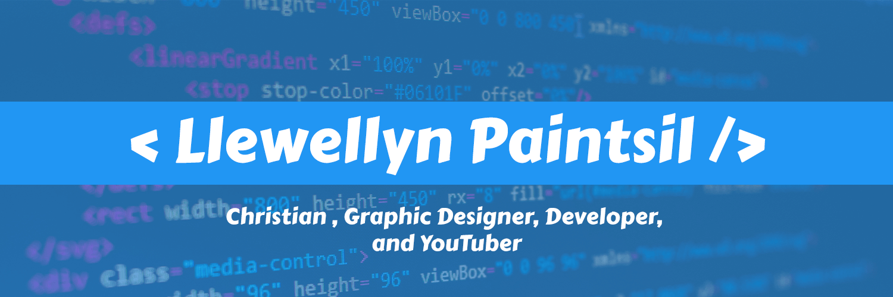

<!-- Banner -->

<!-- Intro Cards -->

   

<!-- Heading -->
<h1> 
Hi there , I'm Llewellyn Adonteng Paintsil 
</h1>

<!-- Body -->

I'm a Christian, Student, Graphic Designer, Developer, and Youtube content creator. I have two youtube channels <a href="http://www.youtube.com/c/LPTeach" target="_blank">LP Teach</a> & <a href="https://www.youtube.com/channel/UCcXLspJdUMq5E8-jU0CXuNA" target="_blank">Arclapain</a>. I'm from Ghana and started coding with only my phone in the year 2020 during the Covid pandemic. It wasn't easy using only a phone to write code and learn, but with God's help I was able to go through that tough time. I had great interest in computers long before the Corona pandemic but I didn't want to distract myself from my school work too much so I suppressed those interests to make sure I pass.

<ul>
<li>📚 I’m currently learning to pass my examinations to get into a good university!</li>
<li>🌱 I'm aiming to become a great Developer 👨‍💻 and Digital Creator 🎥.</li>
<li>👯 I’m looking to collaborate with other content creators.</li>
<li>🥅 2020 and beyond Goals: Become a Full stack web developer and Contribute more to Open Source projects and my country.</li>
<li>⚡ Fun fact about me: I love to draw, watch anime, play video games but above all of them, I love to code.</li>
</ul>

<!-- Social Media Links -->
<h2>📱 Connect with me:</h2>

--- 

<h2>💬 Languages:</h2>

<h2>📚 Frameworks, Platforms and Libraries</h2>

<h2>🕓 Version Control:</h2>

<h2>💻 IDEs/Editors:</h2>

<h2>🎨 Design:</h2>

<h2>🎛️ Operating System:</h2>

<h2>🌐 Browsers:</h2>

<h2>🥅 Other:</h2>

 

<h2 align="center"> 📺 Latest LP Teach YouTube Videos  </h2>

<!-- LP-TEACH-YOUTUBE:START --><table><tr><td></td>
<td><a href="https://www.youtube.com/watch?v=4sqDPseWlFQ">Trailer</a> 24 Oct, 2022</td></tr></table>
<!-- LP-TEACH-YOUTUBE:END -->

<h2 align="center"> 📺 Latest Arclapain YouTube Videos  </h2>

<!-- ARCLAPAIN-YOUTUBE:START --><table><tr><td></td>
<td><a href="https://www.youtube.com/watch?v=-cN-CX9d8e4">Cyberpunk 2077 Map Glitch Fix</a> 28 Oct, 2022</td></tr></table>
<table><tr><td></td>
<td><a href="https://www.youtube.com/watch?v=LxZJHVceJ_M">Cyberpunk 2077 Gameplay Part 1 | No Commentary</a> 27 Oct, 2022</td></tr></table>
<table><tr><td></td>
<td><a href="https://www.youtube.com/watch?v=mohQqbcgqP0">Horizon Zero Dawn Gameplay Part 1 | No Commentary</a> 26 Oct, 2022</td></tr></table>
<table><tr><td></td>
<td><a href="https://www.youtube.com/watch?v=GBC5B88LY3Q">Battlefield V Gameplay part 2 | No Commentary</a> 25 Oct, 2022</td></tr></table>
<table><tr><td></td>
<td><a href="https://www.youtube.com/watch?v=Hy_Rf0vGOr4">Age of Empires IV Gameplay Part 4 | No Commentary</a> 24 Oct, 2022</td></tr></table>
<!-- ARCLAPAIN-YOUTUBE:END -->

<h2 align="center"> 👌 GitHub Stats </h2>

