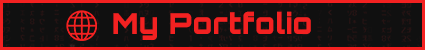
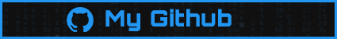
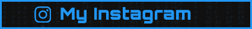

<!-- Banner -->

<!-- INTRO BADGES START -->

<!-- My portfolio -->
 
<!-- My Github -->

<!-- My Twitter -->

<!-- My Instagram -->

<!-- INTRO BADGES END -->

<!-- HEADING START -->
<h1> 
 Hi There! 

I'm Llewellyn Paintsil 
</h1>

<!-- BODY START -->

I am a tormented being, a Student, Graphic Designer, Developer, and YouTube content creator from Ghana. Amidst the shadows of the Covid pandemic in 2020, I began coding with only my phone, a cruel tool of limitation. With divine intervention, I endured, suppressed my love for computers to pass the trials of academia. Explore my GitHub profile, where darkness and creativity intertwine, and witness the remnants of shattered dreams. Enter this abyss, if you dare, and embrace the void that awaits.

<ul>
<li>📚 Enslaved in the depths of Computer Science at KNUST</li>
<li>🌱 Aiming to become a formidable Developer 👨‍💻 and Digital Creator 🎥</li>
<li>👯 Desperately seeking collaboration with fellow content creators</li>
<li>🥅 2020 and beyond Goals: Ascend as a Full-stack web developer, Contribute to Open Source projects, and salvage my country</li>
<li>⚡ Fun fact: I am bound to the art of drawing, immersed in the realm of anime, and shackled by the chains of video games. But above all, I derive sinister pleasure from bringing ideas to life</li>
</ul>

<!-- BODY END -->

<!-- SOCIAL MEDIA LINKS START -->
<h2> Connect with me: </h2>

<!-- SOCIAL MEDIA LINKS END -->

<!-- --- 

<h2 align="center"> 👨‍💻 Languages and Tools:</h2>
 

  

--- -->

---

<h2 align="center"> Latest LAP YouTube Videos </h2>

<!-- LP-TEACH-YOUTUBE:START --><table><tr><td></td>
<td><a href="https://www.youtube.com/watch?v=S3Z8imcc61A">Useless Apps Part 02</a> 5 Jun, 2023</td></tr></table>
<table><tr><td></td>
<td><a href="https://www.youtube.com/watch?v=lYJUEe0_yzk">Top 3 Linux Video Players</a> 10 May, 2023</td></tr></table>
<table><tr><td></td>
<td><a href="https://www.youtube.com/watch?v=9QwHG2Tvwfs">A Word for Art Part 4 &lpar;Ant-man and the Wasp Quantumania&rpar;</a> 19 Feb, 2023</td></tr></table>
<table><tr><td></td>
<td><a href="https://www.youtube.com/watch?v=8-_RD325V2A">A Word for Art Part 03 &lpar;Word&rpar;</a> 8 Feb, 2023</td></tr></table>
<table><tr><td></td>
<td><a href="https://www.youtube.com/watch?v=G1OQbTcYWm4">A Word For Art Part 02</a> 20 Jan, 2023</td></tr></table>
<!-- LP-TEACH-YOUTUBE:END -->

---

<h2 align="center"> Latest Arclapain YouTube Videos </h2>

<!-- ARCLAPAIN-YOUTUBE:START --><table><tr><td></td>
<td><a href="https://www.youtube.com/watch?v=6EphOvISc7g">Ace Racer Walkthrough Gameplay</a> 5 Jul, 2023</td></tr></table>
<table><tr><td></td>
<td><a href="https://www.youtube.com/watch?v=mUmXyiI-ccc">Sable Walkthrough Gameplay</a> 4 Jul, 2023</td></tr></table>
<table><tr><td></td>
<td><a href="https://www.youtube.com/watch?v=silym6900OA">Evil Dead The Game Walkthrough Gameplay</a> 3 Jul, 2023</td></tr></table>
<table><tr><td></td>
<td><a href="https://www.youtube.com/watch?v=3Wa8WftxmI4">Zuma Deluxe Walkthrough Gameplay Part 05</a> 30 Jun, 2023</td></tr></table>
<table><tr><td></td>
<td><a href="https://www.youtube.com/watch?v=bRwEP5Nkdo0">Zuma Deluxe Walkthrough Gameplay Part 04</a> 29 Jun, 2023</td></tr></table>
<!-- ARCLAPAIN-YOUTUBE:END -->

---

<h2 align="center"> GitHub Stats </h2>

