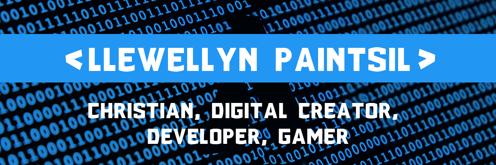

<!-- Banner -->

 

<!-- Intro Cards -->

  

 

<!-- Heading -->
<h1> 
Hi there , I'm Llewellyn Adonteng Paintsil 
</h1>

<!-- Body -->

I'm a Christian, Student, Graphic Designer, Developer, and Youtube content creator. I have two youtube channels <a href="http://www.youtube.com/c/LPTeach">LP Teach</a> & <a href="https://www.youtube.com/channel/UCcXLspJdUMq5E8-jU0CXuNA">Arclapain</a>. I'm from Ghana and started coding with only my phone in the year 2020 during the Covid pandemic. It wasn't easy using only a phone to write code and learn, but with God's help I was able to go through that tough time. I had great interest in computers long before the Corona pandemic but I didn't want to distract myself from my school work too much so I suppressed those interests to make sure I pass.

<ul>
<li>📚 I’m currently learning to pass my examinations to get into a good university!</li>
<li>🌱 I'm aiming to become a great Developer 👨‍💻 and YouTuber 🖥.</li>
<li>👯 I’m looking to collaborate with other content creators.</li>
<li>🥅 2020 and beyond Goals: Become a Full stack web developer and Contribute more to Open Source projects and my country.</li>
<li>⚡ Fun fact about me: I love to draw, play the bass guitar, watch anime, play video games but above all of them, I love to code.</li>
</ul>

 

---

 

<!-- Social Media Links -->
<h2>📱 Connect with me:</h2>
 

 

---

 

<h2>💬 Languages:</h2>

 

---

 

### 📚 Libraries:

 

 

### 🛠 Tools:

 

 

<h2 align="center"> 📺 Latest YouTube Videos </h2>

<!-- YOUTUBE:START -->

- [How to play videos in termux](https://www.youtube.com/watch?v=H3dJkbifflQ)
- [Greed Game in termux](https://www.youtube.com/watch?v=CPfYDHdnstM)
- [Use VSCode on mobile](https://www.youtube.com/watch?v=UoYBTrff0g8)
- [How to code React js on mobile VS Code method](https://www.youtube.com/watch?v=9T-6waVWGb8)
- [How to remove evil eye banner in Termux](https://www.youtube.com/watch?v=wFFEz8AcL74)
  <!-- YOUTUBE:END -->
  ➡️ [more videos...](http://www.youtube.com/c/LPTeach)

 

 

<h2 align="center"> 👌 GitHub Stats </h2>

